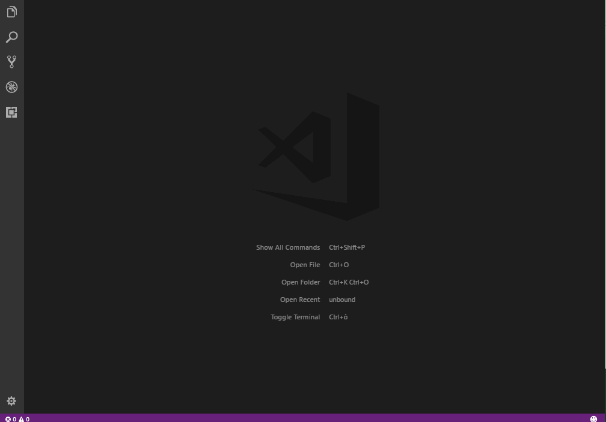

# VSCode - Motivational GIF

Sometimes you just need a little push to get through the day.

## Features

When you are feeling down and low, just open the VSCode command palette and type `motivateMe` to get a little dose of motivation.

## Extension Settings

You can optionally define a custom library of GIFs instead of viewing random GIFs from [GIPHY](http://giphy.com)'s API. To do so, edit the following settings in VSCode:

* `motivateMe.gifLibrary`

This must be an array of strings, each string a direct link to the GIF file, with `.gif` extension.
For example: `"https://media.giphy.com/media/qDPg6HNz2NfAk/giphy.gif"`.

## Release Notes

View [Changelog](CHANGELOG.md)
